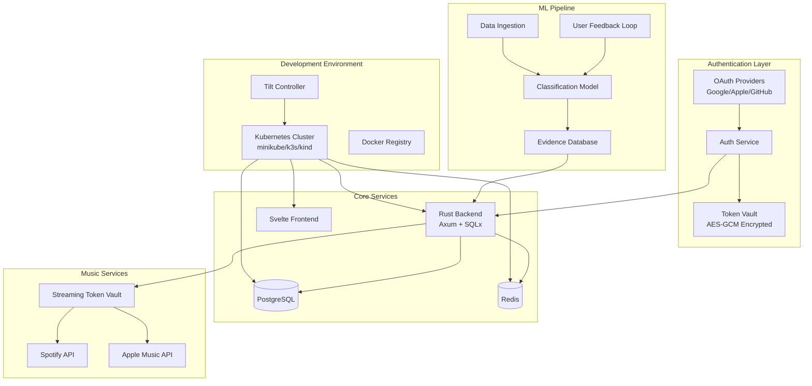
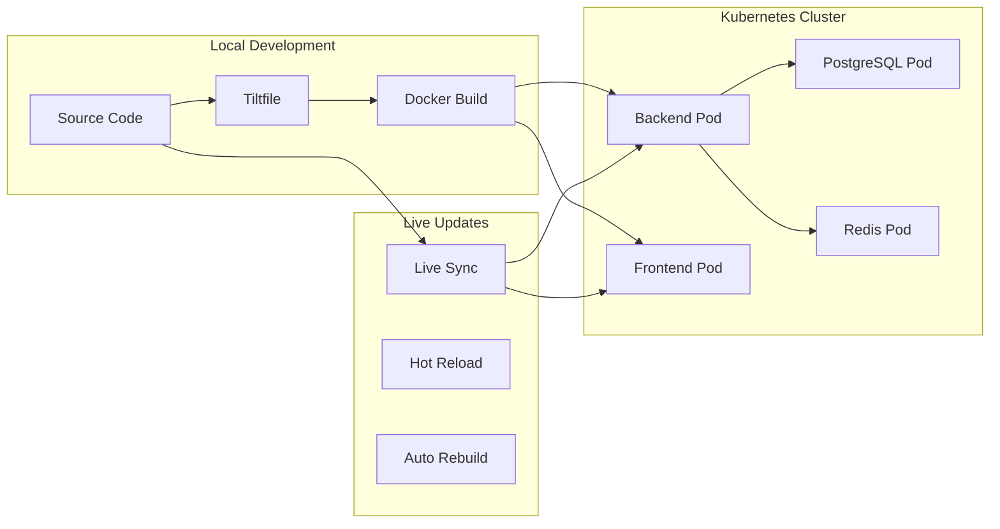

# Design Document

## Overview

This design enhances the existing music streaming blocklist system with three major improvements:

1. **Streamlined Developer Experience**: Modern Kubernetes-based development environment with Tiltfile automation, supporting minikube, k3s, and kind
2. **Social Authentication Integration**: OAuth2 flows for Google, Apple, and GitHub with secure token management
3. **ML-Generated Evidence-Based Blocklists**: Machine learning system that categorizes artists into evidence-based groups with transparency and user feedback loops

The design builds upon the existing Rust/Axum backend and Svelte frontend, extending the current authentication system and adding new ML capabilities.

## Architecture

### High-Level System Architecture



### Development Environment Architecture

The development environment uses a modern Kubernetes-based approach with Tilt for orchestration:



## Components and Interfaces

### 1. Enhanced Development Environment

#### Tiltfile Configuration
- **Multi-platform Support**: Automatic detection and configuration for minikube, k3s, and kind
- **Live Updates**: Real-time code synchronization without full rebuilds
- **Optimized Builds**: Multi-stage Docker builds with cargo-chef caching for Rust
- **Manual Triggers**: Database migrations, testing, health checks, and performance monitoring

#### Kubernetes Manifests
- **Namespace Isolation**: Development resources in dedicated namespace
- **Service Dependencies**: Proper startup ordering with health checks
- **Port Forwarding**: Predictable local endpoints for all services
- **Resource Management**: Appropriate limits and requests for development

#### Performance Optimizations
- **Docker Layer Caching**: BuildKit inline caching and multi-stage builds
- **Parallel Updates**: Concurrent service updates for faster feedback
- **Live Reload**: Sub-10-second feedback loops for code changes
- **Cache Warming**: Pre-built base layers for faster initial builds

### 2. Social Authentication System

#### OAuth Provider Integration

**Google OAuth2**
```rust
pub struct GoogleOAuthProvider {
    client_id: String,
    client_secret: String,
    redirect_uri: String,
    scopes: Vec<String>, // ["openid", "email", "profile"]
}

impl OAuthProvider for GoogleOAuthProvider {
    async fn get_authorization_url(&self) -> Result<String>;
    async fn exchange_code(&self, code: &str) -> Result<OAuthTokens>;
    async fn get_user_info(&self, access_token: &str) -> Result<OAuthUserInfo>;
    async fn refresh_token(&self, refresh_token: &str) -> Result<OAuthTokens>;
}
```

**Apple Sign In**
```rust
pub struct AppleOAuthProvider {
    client_id: String,
    team_id: String,
    key_id: String,
    private_key: String, // P8 private key
    redirect_uri: String,
}

impl OAuthProvider for AppleOAuthProvider {
    // Apple-specific JWT-based authentication
    async fn create_client_secret(&self) -> Result<String>;
    async fn verify_id_token(&self, id_token: &str) -> Result<AppleUserInfo>;
}
```

**GitHub OAuth**
```rust
pub struct GitHubOAuthProvider {
    client_id: String,
    client_secret: String,
    redirect_uri: String,
    scopes: Vec<String>, // ["user:email"]
}
```

#### Enhanced Authentication Service

```rust
pub struct EnhancedAuthService {
    db_pool: PgPool,
    jwt_secret: String,
    oauth_providers: HashMap<String, Box<dyn OAuthProvider>>,
    token_vault: Arc<TokenVault>,
}

impl EnhancedAuthService {
    // Social authentication methods
    pub async fn initiate_oauth_flow(&self, provider: &str) -> Result<OAuthFlowResponse>;
    pub async fn complete_oauth_flow(&self, provider: &str, code: &str, state: &str) -> Result<AuthResponse>;
    pub async fn link_oauth_account(&self, user_id: Uuid, provider: &str, code: &str) -> Result<()>;
    pub async fn unlink_oauth_account(&self, user_id: Uuid, provider: &str) -> Result<()>;
    
    // Account merging
    pub async fn merge_accounts(&self, primary_user_id: Uuid, secondary_user_id: Uuid) -> Result<()>;
    
    // Enhanced token management
    pub async fn refresh_oauth_tokens(&self, user_id: Uuid, provider: &str) -> Result<()>;
}
```

#### Database Schema Extensions

```sql
-- OAuth provider accounts
CREATE TABLE oauth_accounts (
    id UUID PRIMARY KEY DEFAULT gen_random_uuid(),
    user_id UUID NOT NULL REFERENCES users(id) ON DELETE CASCADE,
    provider VARCHAR(50) NOT NULL, -- 'google', 'apple', 'github'
    provider_user_id VARCHAR(255) NOT NULL,
    email VARCHAR(255),
    display_name VARCHAR(255),
    avatar_url TEXT,
    access_token_encrypted BYTEA, -- AES-GCM encrypted
    refresh_token_encrypted BYTEA,
    token_expires_at TIMESTAMPTZ,
    created_at TIMESTAMPTZ DEFAULT NOW(),
    updated_at TIMESTAMPTZ DEFAULT NOW(),
    UNIQUE(provider, provider_user_id),
    INDEX(user_id, provider)
);

-- Account merge audit trail
CREATE TABLE account_merges (
    id UUID PRIMARY KEY DEFAULT gen_random_uuid(),
    primary_user_id UUID NOT NULL REFERENCES users(id),
    merged_user_id UUID NOT NULL,
    merged_at TIMESTAMPTZ DEFAULT NOW(),
    merged_by UUID REFERENCES users(id),
    merge_reason TEXT
);
```

### 3. Streamlined Music Service Integration

#### Enhanced Service Connection Flow

```rust
pub struct MusicServiceManager {
    spotify_service: SpotifyService,
    apple_music_service: AppleMusicService,
    token_vault: Arc<TokenVault>,
}

impl MusicServiceManager {
    pub async fn initiate_connection(&self, user_id: Uuid, service: MusicService) -> Result<ConnectionFlowResponse>;
    pub async fn complete_connection(&self, user_id: Uuid, service: MusicService, code: &str) -> Result<()>;
    pub async fn get_connection_status(&self, user_id: Uuid) -> Result<Vec<ServiceConnection>>;
    pub async fn refresh_service_tokens(&self, user_id: Uuid, service: MusicService) -> Result<()>;
    pub async fn disconnect_service(&self, user_id: Uuid, service: MusicService) -> Result<()>;
}
```

#### Unified Library Statistics

```rust
#[derive(Serialize, Deserialize)]
pub struct UnifiedLibraryStats {
    pub total_tracks: u32,
    pub total_artists: u32,
    pub blocked_tracks: u32,
    pub blocked_artists: u32,
    pub services: Vec<ServiceStats>,
    pub last_sync: DateTime<Utc>,
}

#[derive(Serialize, Deserialize)]
pub struct ServiceStats {
    pub service: MusicService,
    pub connected: bool,
    pub tracks: u32,
    pub artists: u32,
    pub last_sync: Option<DateTime<Utc>>,
    pub sync_status: SyncStatus,
}
```

### 4. ML-Generated Evidence-Based Blocklists

#### ML Pipeline Architecture

```rust
pub struct MLBlocklistGenerator {
    model_client: Box<dyn MLModelClient>,
    evidence_store: Arc<EvidenceStore>,
    feedback_processor: Arc<FeedbackProcessor>,
}

pub trait MLModelClient {
    async fn classify_artist(&self, artist_data: &ArtistData) -> Result<Classification>;
    async fn batch_classify(&self, artists: Vec<ArtistData>) -> Result<Vec<Classification>>;
    async fn update_model(&self, feedback: Vec<UserFeedback>) -> Result<ModelUpdateResult>;
}
```

#### Evidence-Based Classification System

```rust
#[derive(Serialize, Deserialize)]
pub struct Classification {
    pub artist_id: Uuid,
    pub categories: Vec<CategoryClassification>,
    pub confidence_score: f32,
    pub evidence: Vec<Evidence>,
    pub model_version: String,
    pub classified_at: DateTime<Utc>,
}

#[derive(Serialize, Deserialize)]
pub struct CategoryClassification {
    pub category: BlocklistCategory,
    pub confidence: f32,
    pub primary_evidence: Vec<EvidenceId>,
}

#[derive(Serialize, Deserialize)]
pub enum BlocklistCategory {
    Violent { severity: ViolenceSeverity },
    Explicit { content_type: ExplicitContentType },
    Controversial { controversy_type: ControversyType },
    BadVibes { vibe_type: VibeType },
    Custom { name: String, description: String },
}

#[derive(Serialize, Deserialize)]
pub struct Evidence {
    pub id: EvidenceId,
    pub source: EvidenceSource,
    pub content: String,
    pub url: Option<String>,
    pub confidence: f32,
    pub verified: bool,
    pub collected_at: DateTime<Utc>,
}
```

#### User Feedback and Transparency System

```rust
pub struct TransparencyService {
    evidence_store: Arc<EvidenceStore>,
    feedback_store: Arc<FeedbackStore>,
}

impl TransparencyService {
    pub async fn get_classification_explanation(&self, artist_id: Uuid, category: BlocklistCategory) -> Result<ClassificationExplanation>;
    pub async fn submit_feedback(&self, user_id: Uuid, feedback: UserFeedback) -> Result<()>;
    pub async fn get_model_performance(&self, category: BlocklistCategory) -> Result<ModelPerformance>;
}

#[derive(Serialize, Deserialize)]
pub struct ClassificationExplanation {
    pub artist_name: String,
    pub category: BlocklistCategory,
    pub confidence: f32,
    pub primary_reasons: Vec<String>,
    pub evidence: Vec<Evidence>,
    pub similar_artists: Vec<String>,
    pub user_feedback_summary: FeedbackSummary,
}

#[derive(Serialize, Deserialize)]
pub struct UserFeedback {
    pub classification_id: Uuid,
    pub feedback_type: FeedbackType,
    pub reason: Option<String>,
    pub evidence_disputes: Vec<EvidenceDispute>,
}

#[derive(Serialize, Deserialize)]
pub enum FeedbackType {
    Accept,
    Reject { reason: String },
    Mute, // Don't show this classification again
    Dispute { disputed_evidence: Vec<EvidenceId> },
}
```

#### ML Blocklist Management

```rust
pub struct MLBlocklistService {
    ml_generator: Arc<MLBlocklistGenerator>,
    community_service: Arc<CommunityListService>,
    notification_service: Arc<NotificationService>,
}

impl MLBlocklistService {
    pub async fn create_ml_blocklist(&self, category: BlocklistCategory, criteria: ClassificationCriteria) -> Result<CommunityList>;
    pub async fn update_ml_blocklist(&self, list_id: Uuid) -> Result<UpdateResult>;
    pub async fn subscribe_to_ml_blocklist(&self, user_id: Uuid, list_id: Uuid, preferences: SubscriptionPreferences) -> Result<()>;
    pub async fn review_pending_additions(&self, user_id: Uuid, list_id: Uuid) -> Result<Vec<PendingAddition>>;
    pub async fn approve_additions(&self, user_id: Uuid, approvals: Vec<AdditionApproval>) -> Result<()>;
}

#[derive(Serialize, Deserialize)]
pub struct SubscriptionPreferences {
    pub auto_approve_high_confidence: bool, // > 0.9 confidence
    pub notification_frequency: NotificationFrequency,
    pub categories_of_interest: Vec<BlocklistCategory>,
    pub max_additions_per_batch: u32,
}
```

## Data Models

### Enhanced User Model

```rust
#[derive(Serialize, Deserialize)]
pub struct EnhancedUser {
    pub id: Uuid,
    pub email: String,
    pub email_verified: bool,
    pub password_hash: Option<String>, // Optional for OAuth-only users
    pub oauth_accounts: Vec<OAuthAccount>,
    pub music_service_connections: Vec<MusicServiceConnection>,
    pub ml_preferences: MLPreferences,
    pub totp_enabled: bool,
    pub created_at: DateTime<Utc>,
    pub updated_at: DateTime<Utc>,
    pub last_login: Option<DateTime<Utc>>,
}

#[derive(Serialize, Deserialize)]
pub struct OAuthAccount {
    pub provider: String,
    pub provider_user_id: String,
    pub email: Option<String>,
    pub display_name: Option<String>,
    pub avatar_url: Option<String>,
    pub linked_at: DateTime<Utc>,
}

#[derive(Serialize, Deserialize)]
pub struct MusicServiceConnection {
    pub service: MusicService,
    pub connected_at: DateTime<Utc>,
    pub last_sync: Option<DateTime<Utc>>,
    pub sync_enabled: bool,
    pub permissions: Vec<String>,
}
```

### ML Blocklist Models

```rust
#[derive(Serialize, Deserialize)]
pub struct MLBlocklist {
    pub id: Uuid,
    pub name: String,
    pub description: String,
    pub category: BlocklistCategory,
    pub classification_criteria: ClassificationCriteria,
    pub confidence_threshold: f32,
    pub auto_update: bool,
    pub created_by: MLSystemInfo,
    pub subscriber_count: u32,
    pub artist_count: u32,
    pub last_updated: DateTime<Utc>,
    pub model_version: String,
}

#[derive(Serialize, Deserialize)]
pub struct ClassificationCriteria {
    pub minimum_confidence: f32,
    pub required_evidence_types: Vec<EvidenceSource>,
    pub exclusion_rules: Vec<ExclusionRule>,
    pub human_review_required: bool,
}
```

## Error Handling

### Enhanced Error Types

```rust
#[derive(Debug, thiserror::Error)]
pub enum EnhancedAuthError {
    #[error("OAuth provider error: {provider} - {message}")]
    OAuthProviderError { provider: String, message: String },
    
    #[error("Account merge conflict: {reason}")]
    AccountMergeConflict { reason: String },
    
    #[error("Token encryption error: {0}")]
    TokenEncryptionError(#[from] aes_gcm::Error),
    
    #[error("ML classification error: {0}")]
    MLClassificationError(String),
    
    #[error("Evidence validation error: {0}")]
    EvidenceValidationError(String),
}
```

### Error Recovery Strategies

1. **OAuth Failures**: Graceful fallback to email/password authentication
2. **Token Refresh Failures**: Automatic re-authentication prompts
3. **ML Service Failures**: Fallback to manual curation with user notification
4. **Account Merge Conflicts**: Manual resolution workflow with admin intervention

## Testing Strategy

### Development Environment Testing

```rust
#[cfg(test)]
mod dev_environment_tests {
    #[tokio::test]
    async fn test_tilt_configuration() {
        // Test Tiltfile parsing and validation
        // Verify all services start correctly
        // Check live update functionality
    }
    
    #[tokio::test]
    async fn test_kubernetes_manifests() {
        // Validate K8s resource definitions
        // Test service dependencies
        // Verify health checks
    }
}
```

### Social Authentication Testing

```rust
#[cfg(test)]
mod oauth_tests {
    use wiremock::{MockServer, Mock, ResponseTemplate};
    
    #[tokio::test]
    async fn test_google_oauth_flow() {
        let mock_server = MockServer::start().await;
        
        // Mock Google OAuth endpoints
        Mock::given(method("POST"))
            .and(path("/oauth2/v4/token"))
            .respond_with(ResponseTemplate::new(200)
                .set_body_json(json!({
                    "access_token": "mock_access_token",
                    "refresh_token": "mock_refresh_token",
                    "expires_in": 3600
                })))
            .mount(&mock_server)
            .await;
        
        // Test OAuth flow
        let auth_service = create_test_auth_service(&mock_server.uri()).await;
        let result = auth_service.complete_oauth_flow("google", "test_code", "test_state").await;
        
        assert!(result.is_ok());
    }
    
    #[tokio::test]
    async fn test_account_merging() {
        // Test merging OAuth accounts with existing users
        // Verify data integrity during merge
        // Test conflict resolution
    }
}
```

### ML System Testing

```rust
#[cfg(test)]
mod ml_tests {
    #[tokio::test]
    async fn test_artist_classification() {
        let ml_service = create_test_ml_service().await;
        
        let artist_data = ArtistData {
            name: "Test Artist".to_string(),
            genres: vec!["metal".to_string()],
            lyrics_sample: Some("violent lyrics content".to_string()),
        };
        
        let classification = ml_service.classify_artist(&artist_data).await.unwrap();
        
        assert!(classification.categories.iter().any(|c| matches!(c.category, BlocklistCategory::Violent { .. })));
        assert!(classification.confidence_score > 0.0);
        assert!(!classification.evidence.is_empty());
    }
    
    #[tokio::test]
    async fn test_user_feedback_processing() {
        // Test feedback collection and model updates
        // Verify transparency features
        // Test dispute resolution
    }
}
```

### Integration Testing Strategy

1. **End-to-End OAuth Flows**: Complete authentication workflows for each provider
2. **Music Service Integration**: Token management and API interactions
3. **ML Pipeline Testing**: Classification accuracy and feedback loops
4. **Performance Testing**: Load testing for ML classification at scale
5. **Security Testing**: Token encryption, OAuth security, and data protection

### Performance Testing

```rust
#[cfg(test)]
mod performance_tests {
    use criterion::{criterion_group, criterion_main, Criterion};
    
    fn benchmark_ml_classification(c: &mut Criterion) {
        c.bench_function("classify_single_artist", |b| {
            b.iter(|| {
                // Benchmark single artist classification
            });
        });
        
        c.bench_function("classify_batch_artists", |b| {
            b.iter(|| {
                // Benchmark batch classification
            });
        });
    }
    
    criterion_group!(benches, benchmark_ml_classification);
    criterion_main!(benches);
}
```

This design provides a comprehensive foundation for implementing the enhanced developer experience, social authentication, and ML-powered features while maintaining security, performance, and user experience standards.