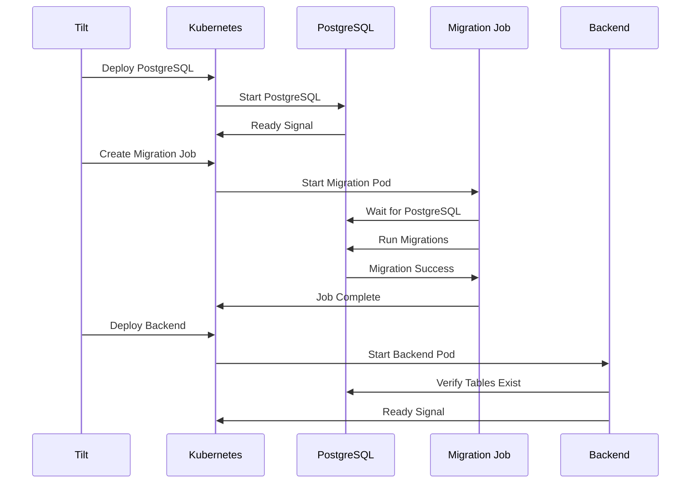

# Database Migration System

This document describes the automated database migration system implemented for the Kiro development environment.

## Overview

The migration system ensures that database schema changes are applied automatically and consistently across all development environments. It uses Kubernetes Jobs to run migrations before the backend application starts, preventing "relation does not exist" errors and ensuring data consistency.

## Architecture

### Components

1. **Migration Job** (`k8s/dev/migration-job.yaml`)
   - Kubernetes Job that runs database migrations automatically
   - Executes before backend deployment starts
   - Uses the same backend image to ensure migration compatibility
   - Includes comprehensive error handling and verification

2. **Seed Data Job** (`k8s/dev/migration-job.yaml`)
   - Optional Kubernetes Job for loading development test data
   - Manual trigger only (suspended by default)
   - Runs after migration completion
   - Includes sample users, artists, and DNP entries

3. **Backend Init Containers** (in `k8s/dev-manifests.yaml`)
   - Wait for PostgreSQL and Redis to be ready
   - Verify migration completion before backend starts
   - Include comprehensive table existence checks

4. **Enhanced Health Checks**
   - Backend health endpoint verifies database schema
   - Includes table existence verification
   - Provides detailed migration status information

## Migration Flow



## Migration Job Details

### Automatic Migration Process

The migration job performs the following steps:

1. **Wait for PostgreSQL**: Ensures database is ready and accessible
2. **Create Migration Tracking**: Sets up `sqlx_migrations` table if needed
3. **Apply Migrations**: Runs each migration file in order
4. **Verify Schema**: Confirms all critical tables exist
5. **Record Success**: Updates migration tracking table

### Migration Files

Located in `backend/migrations/`, these SQL files define the database schema:

- `001_initial_schema.sql` - Core tables (users, artists, connections)
- `002_indexes.sql` - Performance indexes
- `003_rate_limiting_and_jobs.sql` - Background job system
- `004_audit_compliance.sql` - SOC2 compliance logging
- `005_content_moderation.sql` - Community moderation system
- `006_health_check_table.sql` - Health monitoring
- `007_auth_sessions.sql` - Authentication sessions
- `008_audit_logging_and_rate_limiting.sql` - Enhanced logging

### Error Handling

The migration job includes comprehensive error handling:

- **Retry Logic**: Failed migrations are retried up to 3 times
- **Rollback Prevention**: Failed migrations are recorded but don't block retries
- **Verification**: Post-migration table existence checks
- **Logging**: Detailed logs for troubleshooting

## Development Workflow

### Automatic Startup

When running `tilt up`:

1. PostgreSQL and Redis start first
2. Migration job runs automatically
3. Backend waits for migration completion
4. Frontend starts after backend is ready

### Manual Operations

Available Tilt triggers:

- **`db-migrate`**: Re-run migrations manually
- **`db-seed`**: Load development test data
- **`db-reset`**: Reset database and migration state
- **`db-status`**: Show database tables and migration history
- **`dev-setup`**: Complete environment verification

### Health Monitoring

- **`health-check`**: Comprehensive service health verification
- **Backend `/health`**: Includes database schema verification
- **Migration Logs**: `kubectl logs job/database-migration -n kiro-dev`

## Seed Data System

### Test Data

The seed data job creates:

- **Test Users**: `test@example.com` and `dev@example.com` (password: `password123`)
- **Test Artists**: Drake, Kanye West, Chris Brown with external IDs
- **DNP Entries**: Sample blocklist entries for testing
- **Community Lists**: Example shared lists and subscriptions

### Manual Seeding

```bash
# Load test data (via Tilt trigger)
tilt trigger db-seed

# Or manually via kubectl
kubectl patch job database-seed -n kiro-dev -p '{"spec":{"suspend":false}}'
```

## Troubleshooting

### Common Issues

1. **Migration Job Fails**
   ```bash
   kubectl logs job/database-migration -n kiro-dev
   kubectl describe job database-migration -n kiro-dev
   ```

2. **Backend Won't Start**
   - Check migration job completion
   - Verify table existence
   - Review backend init container logs

3. **Tables Missing**
   ```bash
   kubectl exec deployment/postgres -n kiro-dev -- psql -U kiro -d kiro -c "\\dt"
   ```

### Reset Procedure

To completely reset the database:

```bash
# Via Tilt trigger
tilt trigger db-reset

# Or manually
kubectl exec deployment/postgres -n kiro-dev -- psql -U kiro -d postgres -c "DROP DATABASE IF EXISTS kiro; CREATE DATABASE kiro;"
kubectl delete job database-migration database-seed -n kiro-dev --ignore-not-found=true
```

## Testing

### Verification Script

Run the verification script to check setup:

```bash
./scripts/verify-migration-setup.sh
```

### Migration Test

Test the migration job in isolation:

```bash
./scripts/test-migration-job.sh
```

## Configuration

### Environment Variables

- `DATABASE_URL`: PostgreSQL connection string
- `PGPASSWORD`: PostgreSQL password for migration scripts
- `RUST_LOG`: Logging level for migration job

### Kubernetes Resources

- **Migration Job**: 128Mi memory, 100m CPU
- **Seed Job**: 128Mi memory, 100m CPU
- **TTL**: Migration job cleaned up after 24 hours
- **Backoff**: Up to 3 retry attempts for failed jobs

## Security Considerations

- Migration jobs run with minimal privileges
- Database credentials are managed via Kubernetes environment variables
- Migration tracking prevents replay attacks
- Seed data is only loaded in development environments

## Performance

- **Migration Time**: Typically 10-30 seconds for full schema
- **Startup Impact**: Backend waits for migration completion
- **Resource Usage**: Minimal - migration job is ephemeral
- **Caching**: Docker layer caching optimizes rebuild times

## Future Enhancements

- **Production Migrations**: Separate production migration strategy
- **Schema Validation**: Automated schema drift detection
- **Rollback Support**: Automated rollback for failed migrations
- **Migration Testing**: Automated migration testing in CI/CD