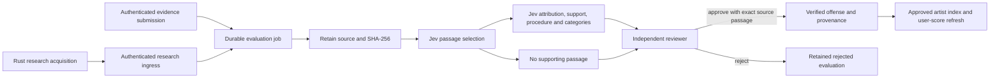

# Jev evidence evaluation architecture

Implemented on `codex/jev-evaluation-core`, 2026-09-27. This is a local implementation and validation record; no application deployment or production data migration was performed.

## Contract

Jev is the shared semantic evaluator for user evidence and research articles. It selects a source passage, evaluates attribution and support, reports the procedural state, and scores independent misconduct categories. Code controls identity, quotas, retries, permissions and publication. A model response never verifies an offense or executes a streaming-provider action.

“Verified” in this workflow means an independent reviewer approved a source-backed record. It is not a finding of guilt. The source's reported outcome remains explicit, including dismissal, acquittal and settlement. Reviewers can correct a model miss using an exact passage from the retained source, confirm the procedural state, and record their reason. Original model answers remain intact.



## Components

| Component | Responsibility |
| --- | --- |
| `convex/lib/jev.ts` | Validated HTTP adapter and two-stage typed evaluation |
| `convex/lib/evaluationPolicy.ts` | Versioned taxonomy, severity aliases, limits and reviewer rules |
| `convex/evaluations.ts` | Atomic intake/quota/deduplication, job transitions, review and publication |
| `convex/evaluationWorker.ts` | Source acquisition, retained-source hashing, Jev calls and safe failures |
| `convex/researchIngress.ts` | Bearer-authenticated allowlist of internal ingestion operations |
| `convex/researchLifecycle.ts` | Research acquisition claims, completion callbacks and expiration |
| `convex/newsIngestion.ts` | Internal raw research writes; all resolved artist entities enter evaluation |
| Rust `ConvexClient` / `OffenseCreator` | Authenticated ingestion and candidate queuing; no direct offense creation |
| `EvidenceEvaluationStatus.svelte` | Honest queued, failed, unsupported and review states |
| `EvidenceReviewPanel.svelte` | Reviewer source inspection, corrections, decisions and retries |
| `scripts/evaluation/` | Synthetic cases and an explicit live-model regression command |

`evidenceVerifier.submitEvidence` remains a compatibility entry point and returns `{jobId, accepted: true, verified: false}`. Old caller-supplied category hints do not become authoritative classifications. Research ingestion is internal; its service route cannot call arbitrary Convex functions, assign roles, approve evidence or execute enforcement. Supplied `humanVerified` flags are ignored.

## Semantic judgments

The native [TypeSafe HTTP API](https://docs.typesafe.ai/api) is pinned to `jev-1.13.0`; the policy is `evidence-v1`. The installed [TypeSafe skill](../../.agents/skills/typesafe-ai/SKILL.md) informed this decomposition. References: [Choice](https://docs.typesafe.ai/primitives/choice), [Noul](https://docs.typesafe.ai/primitives/noul), and [citation checking](https://docs.typesafe.ai/cookbooks/citation_check).

1. Code retains up to 24,000 characters and creates overlapping 1,200-character passages with exact offsets. Truncation is recorded, including across retries.
2. One Choice question selects a supporting passage or `none`. With `none`, role is `not_assessed`; the model has not classified the artist's role. The result remains available for reviewer correction.
3. For a selected passage, one request asks independent Choice questions for role, allegation support, and procedural state, plus one Noul question per category. Categories are multi-label.
4. Response validation checks the model version, expected question/option sets, probability bounds, normalized distributions, selected maxima and token counts. Invalid responses fail safely.
5. An uncalibrated 0.8 threshold supplies category suggestions and distinguishes confidently unsupported passages. Everything else with a passage goes to review. These scores are not calibrated probabilities that misconduct occurred.

Source text is explicitly treated as untrusted data. Prompts exclude memory-based allegations, lyrics, idioms, victim experiences and other people's conduct. These are mitigations to measure, not guarantees against prompt injection or mistaken attribution.

## Durable state and permissions

Evaluation lifecycle: `queued → running → needs_review | no_support`. Transient failures enter `retry_wait`; terminal failures become `failed`. Independent review yields `approved` or `rejected`. Only failed jobs can be manually retried.

- Intake, quota reservation and scheduling are one Convex transaction. Each authenticated user can create ten new jobs per UTC day. Duplicate intake does not spend another quota unit.
- Deduplication key: policy version, pinned model, submitting user (or research), artist ID and canonical URL. Repeated calls return the existing job.
- Workers have a three-minute lease, a watchdog, four automatic attempts and a monotonically increasing generation. Late workers cannot overwrite newer attempts, including after a manual retry. HTTP 429/5xx and network failures retry with backoff; Jev `Retry-After` is honored up to one hour. Provider error bodies and credentials are not exposed.
- Only the submitter or an `owner`/`reviewer` can inspect a private submission. Only reviewers can approve, reject or retry. A submitter cannot review their own submission, even if they hold a reviewer role.
- Approval requires a reason, supported category and severity, explicit procedural state, and an exact 20–1,200-character passage in the retained source. Review writes the offense, evidence provenance, job decision and artist index atomically, then schedules affected-user score recomputation.
- The public extension catalog excludes personal block choices and non-verified offenses. Categories, grading and the artist index use verified offenses. Severity aliases map `low/medium/high/critical` to `minor/moderate/severe/egregious`.

Research acquisition has a separate ten-minute claim and generation. HTTP 202 means queued, never completed. The Rust worker reports actual completion through the authenticated ingress. Only a matching successful callback stamps `lastInvestigatedAt`; failures do not. Missing callbacks expire and become eligible for a later investigation cycle. An expired Rust task may finish late, but its stale callback cannot mark a newer attempt complete. Evaluation jobs already ingested are independent of the acquisition worker's lifetime. Existing sync-run counters summarize dispatch, not final evidence approval.

## Configuration and coordinated rollout

The TypeSafe skill was installed with one method:

```sh
npx skills add typesafe-ai/skills --skill typesafe-ai --agent codex --yes
```

The skill and lockfile are in the repository. `AGENTS.md` directs future evaluation work to it.

| Location | Configuration |
| --- | --- |
| Convex deployment secrets | `TYPESAFE_API_KEY`, `FIRECRAWL_API_KEY` when URL fetching is needed, `NDITH_SERVICE_KEY` |
| Convex runtime config | `TYPESAFE_MODEL=jev-1.13.0`, `NDITH_BACKEND_URL` |
| Rust research service | `CONVEX_URL`, optional `CONVEX_SITE_URL`, matching `NDITH_SERVICE_KEY`, existing acquisition/provider configuration |
| Web frontend | Existing `VITE_CONVEX_URL`; no Jev or service key in any `VITE_*` variable |

The key from the user-designated 1Password item was injected into a child process for the synthetic live test. It was not written to an environment file, committed, printed, or configured in a remote deployment. A key in a local shell does not configure Convex.

Rollout requires an authenticated Convex deployment and coordinated Convex/Rust/frontend releases:

1. Configure the Convex secrets and the matching Rust ingress key using the secret manager. Use the Convex HTTP-action `.convex.site` endpoint; the Rust client derives it from `.convex.cloud` if no override is supplied.
2. Pause legacy ingestion while deploying the internal-function/ingress change and updated Rust client. Deploy the frontend with the same backend contract. The old unauthenticated mutation transport intentionally stops working.
3. Provision at least two appropriate operator identities through the trusted admin/deployment process when an operator also submits sources. There is no new public role-assignment endpoint.
4. In staging, submit a source and confirm queued → review → independent approval, including a provider failure and a stale-worker retry. Confirm real Convex JWT subject mapping and service callback connectivity.
5. Rebuild the artist index using the paginated internal rebuild. Legacy classification promotion now queues evaluation candidates; it no longer creates offenses. Recompute existing user summaries as needed.
6. Review historical records before relying on the catalog: existing `verified` rows are not retroactively proven independently reviewed. This change does not rewrite production offenses or reset historically incorrect research freshness timestamps. Plan a backed-up reconciliation for those records.
7. Observe failed-job codes, retries, queue age, reviewer disagreements, source truncation and token usage before expanding acquisition volume.

The generated API files now use Convex's official JS/declaration layout; conflicting handwritten `.ts` versions were removed. The local declarations were regenerated with the installed official template because no `CONVEX_DEPLOYMENT` is configured. Run normal authenticated Convex code generation during staging deployment.

## Verification and limitations

The [live synthetic record](../evaluations/2026-09-27-jev-synthetic.json) contains eight cases, all matching the expected routing. Charged and dismissed cases also match the expected role, procedural state and financial-crime label. No real artist allegation, user library, user identity or private source text was sent in this test. It exercises the live Jev adapter, not a deployed Convex worker or real Firecrawl retrieval.

Local regression coverage includes authentication, quota/deduplication, reviewer independence, source provenance, model errors, retry exhaustion, worker fencing, research callbacks, exclusion of private/unapproved policy data, exact-source corrections, and the rendered review UI. See [implementation verification](../evaluations/2026-09-27-verification.md) for commands and counts.

Eight synthetic cases do not measure real-world precision, recall, demographic performance or calibration. Build a consented, independently labeled, held-out source corpus before making accuracy claims. Include ambiguous aliases, translations, multiple incidents per article, long documents, satire, retractions and conflicting procedural outcomes. Review acceptance and missed allegations need ongoing sampling.

Current limits: one selected incident/passage and one published category per evaluation; 24,000-character source cap; no automatic re-evaluation of a completed URL under the same submitter/model/policy key when a page changes; no global research spend cap; the artist review panel shows the latest 30 jobs, with a separate paginated global `reviewQueue` API for `needs_review`. Research queuing is service-authorized and URL-idempotent, not a general public API. Source fetching is delegated to Firecrawl; local hostname checks are not a DNS-rebinding defense for a future direct fetcher.

No provider writes, production deployment, real OAuth flow, full-platform Linux image or live Stripe payment was tested by this implementation. The remaining build-audit findings continue to apply where the following record does not explicitly address them.
