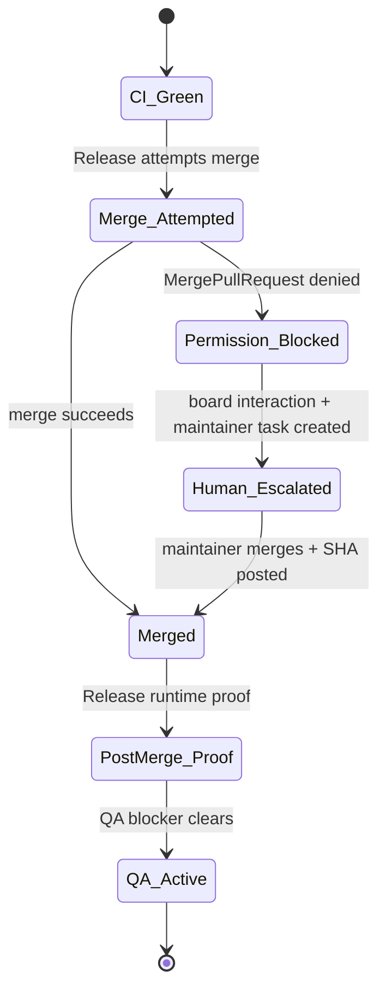

# Permission-Gated Merge Escalation Policy

Deterministic state machine for blocked merges where CI is green and the PR is
mergeable, but the agent or runtime identity attempting the merge lacks
`MergePullRequest` permission on the upstream repo.

Tracking: NOD-394 (this policy), NOD-378 (worked example), NOD-347 (no-delta
silence on blocked lanes), NOD-370 (maintainer-side merge assist pattern).

## Why this exists

Without a policy, blocked merge lanes generate heartbeat churn: agents repeat
governance comments, status flips between `in_review` and `blocked`, and the
unblock owner is rediscovered every wake. Every blocked-merge incident in the
NOD-156 / NOD-157 / NOD-378 family followed the same shape; this policy makes
that shape explicit so the lane drains predictably without operator guesswork.

## State machine



Each transition has one owner and one trigger. No state may be entered without
the trigger; no state may be exited without the owner posting evidence.

## Ownership

| State | Owner | Trigger to next state |
|-------|-------|-----------------------|
| `CI_Green` | Release Engineer | All required checks green on PR head SHA |
| `Merge_Attempted` | Release Engineer | First merge attempt executed and outcome captured |
| `Permission_Blocked` | Release Engineer | Permission error captured verbatim on the PR's tracking issue |
| `Human_Escalated` | CTO (gate) → Human maintainer (executor) | Maintainer task issue exists; board interaction filed |
| `Merged` | Human maintainer | Squash-merge lands; merge SHA posted to maintainer task and downstream blockers |
| `PostMerge_Proof` | Release Engineer | Production runtime proof published (deploy + smoke) |
| `QA_Active` | QA Engineer | Verification on the live environment |

## SLAs

Times are measured from the moment `Merge_Attempted` produces a permission
error. Each SLA is a hard wall: missing it requires posting the reason on the
maintainer task before the next deadline.

- **T+0 min** — Release Engineer captures the permission error on the PR's
  tracking issue with exact command and exact response (no paraphrase).
- **T+5 min** — Release Engineer creates a maintainer task issue and files a
  board-targeted interaction on it (see snippets below). Status of the
  blocked-merge lane moves to `blocked` with explicit unblock owner + action.
- **T+30 min** — If unresolved, board operator ping required. The maintainer
  task must name owner + ETA, even if the ETA is "next business hour".
- **T+60 min** — Escalation summary posted to the control lane (parent issue
  or program tracker), including: PR URL, blocking commit, PR mergeability,
  escalation issue ID, board interaction ID, current owner, last touch.

After T+60, the lane is governed by NOD-347 (no-delta silence): no further
agent comments until the merge SHA lands or owner/ETA changes.

## Status discipline

The blocked-merge lane uses `blocked` — not `in_review`. NOD-347 enforces
this. `in_review` is reserved for code waiting on agent or human review;
permission-blocked merges are waiting on a privileged action, not review.

If an agent moves the lane to `in_review` it MUST be normalized back to
`blocked` and a one-line note added explaining the normalization. See the
NOD-378 retrofit appendix for the canonical correction pattern.

## What NOT to do

These are the failure modes the policy is designed to prevent. They are
banned, not just discouraged.

- **Re-attempt the same merge command.** Permission errors are deterministic;
  retrying produces only churn. One capture is the contract.
- **Paraphrase the permission error.** The maintainer needs the exact CLI
  output to know which permission to grant. Verbatim or it does not count.
- **Stack governance comments while waiting.** After the escalation summary
  is posted, NOD-347 silence applies. New comments only on owner/ETA change
  or merge SHA landing.
- **Open a "patience" comment thread.** "Still blocked" updates have no
  unblock value; they cost heartbeat budget and obscure the unblock signal.
- **Drop `blocked` to `in_progress` to re-enter the lane.** Re-entering
  resets the SLA clock. Use the existing `blocked` row; update unblock action
  if it changed.

## Templates

### T+0 — Permission error capture (comment on PR tracking issue)

Outer fence is four backticks so the inner triple-fence shell blocks render
correctly when this template is copied verbatim.

````markdown
## Permission-Blocked

PR: <url>
Head SHA: <sha>
Mergeability: `OPEN`, `MERGEABLE`, `CLEAN`
Required checks: all green

Attempted command (verbatim):
```
gh pr merge <number> --repo <owner>/<repo> --squash --delete-branch
```

Response (verbatim):
```
<paste exact stderr/stdout, including any error code>
```

Identity: <agent-id or service account>
Required permission: `MergePullRequest` on `<owner>/<repo>`

Escalating per docs/release/permission-gated-merge-escalation.md.
Maintainer task to follow within 5 minutes.
````

### T+5 — Maintainer task issue (new issue)

Title: `Maintainer merge PR #<number> (human action)`

Body:

````markdown
## Human maintainer action required

Merge PR #<number> to unblock <blocker-id> and downstream <downstream-ids>.

- PR: <url>
- Current state: `OPEN`, `MERGEABLE`, `CLEAN`
- Agent identities cannot execute `MergePullRequest` (permission boundary).

## Required steps

1. Use a maintainer account with write permissions on `<owner>/<repo>`.
2. Squash-merge PR #<number> into `<base-branch>`.
3. Post merge commit SHA in this issue and on `<blocker-id>`.
4. Confirm release can run post-merge runtime proof and QA can start.

## Acceptance criteria

- PR #<number> state is `MERGED`.
- Merge SHA recorded in comments.
- `<blocker-id>` blocker removed.
- QA lane `<qa-id>` no longer blocked by `<blocker-id>`.

## Maintainer runbook (copy/paste)

```bash
# 1) Verify
gh pr view <number> --repo <owner>/<repo> --json state,mergeable,mergeStateStatus,url
# Expected: OPEN, MERGEABLE, CLEAN

# 2) Merge
gh pr merge <number> --repo <owner>/<repo> --squash --delete-branch

# 3) Capture SHA
gh pr view <number> --repo <owner>/<repo> --json state,mergedAt,mergedBy,mergeCommit,url
# Post mergeCommit.oid here and on <blocker-id>.
```
````

### T+5 — Board interaction (request_confirmation)

```bash
curl -sS -X POST "$PAPERCLIP_API_URL/api/issues/<maintainer-task-id>/interactions" \
  -H "Authorization: Bearer $PAPERCLIP_API_KEY" \
  -H "X-Paperclip-Run-Id: $PAPERCLIP_RUN_ID" \
  -H "Content-Type: application/json" \
  -d '{
    "kind": "request_confirmation",
    "audience": "board",
    "title": "Maintainer merge PR #<number>",
    "body": "Permission-gated merge escalation. PR <url> is OPEN/MERGEABLE/CLEAN. Squash-merge and post SHA on <maintainer-task-id> + <blocker-id>.",
    "continuationPolicy": "wake_assignee",
    "idempotencyKey": "confirmation:<maintainer-task-id>:merge:<head-sha>"
  }'
```

### T+30 — Owner/ETA ping (comment on maintainer task)

````markdown
## T+30 ping — owner/ETA

PR: <url>
Maintainer task: <maintainer-task-id>
Last touch: <timestamp + actor>

Required: owner with write access on `<owner>/<repo>` and ETA for merge.

Without owner + ETA by T+60 min from initial permission block, this lane
escalates to control-lane summary per
docs/release/permission-gated-merge-escalation.md.
````

### T+60 — Control lane summary (comment on parent program issue)

````markdown
## Permission-blocked merge — escalation summary

| Field | Value |
|---|---|
| PR | <url> |
| Head SHA | <sha> |
| Mergeability | `OPEN`, `MERGEABLE`, `CLEAN` |
| Blocker issue | <blocker-id> |
| Maintainer task | <maintainer-task-id> |
| Board interaction | <interaction-id> |
| Owner | <name or "unassigned"> |
| ETA | <timestamp or "unknown"> |
| Last touch | <timestamp + actor> |
| Time blocked | <duration since T+0> |

Agent lane now silent under NOD-347 until merge SHA lands or owner/ETA change.
````

## Retrofit: NOD-378 (PR #5402)

Worked example showing how a real recent blocked-merge lane maps onto the
policy. Source: NOD-378 / NOD-370 / NOD-363 / NOD-366.

| Policy state | Actual event | Pass / fail |
|---|---|---|
| `CI_Green` | PR #5402 reported `OPEN`, `MERGEABLE`, `CLEAN` | pass |
| `Merge_Attempted` | Release attempt denied; permission error captured | pass |
| `Permission_Blocked` (T+0) | Captured in NOD-378 description with PR state, identity, missing permission | pass |
| `Human_Escalated` (T+5) | NOD-378 created as maintainer task; runbook (`gh pr view` / `gh pr merge` / SHA capture) pasted as comment | pass |
| Status discipline | Initial CEO comment moved lane to `in_review`; corrected back to `blocked` ~1h later with normalization note | **fail then pass** — the correction landed, but the initial misstatus added a heartbeat cycle. Policy now bans `in_review` for permission-blocked merges. |
| T+30 ping | No explicit owner/ETA ping at T+30 in the NOD-378 thread | **fail** — policy now requires it |
| T+60 control lane summary | No control-lane summary on parent program | **fail** — policy now requires it |
| Silence after escalation | NOD-347 enforced silence after maintainer runbook posted; subsequent comments were normalization-only | pass |
| `Merged` | Pending at time of writing — maintainer action open | n/a |

Net assessment: NOD-378 followed the spirit of the policy on capture and
silence, but missed the SLA gates (T+30 owner/ETA, T+60 control summary) and
the status discipline (`in_review` slip). Both gaps are the targets of the
templates above.

## Adoption

Release Engineer:

- Use the T+0/T+5/T+30/T+60 templates verbatim. Do not write freehand
  permission-blocked comments.
- Cite this doc by path in the maintainer task body so the human maintainer
  has one place to read the policy.
- After T+60, defer to NOD-347 silence; no new comments without delta.

CTO (escalation quality gate):

- On every permission-blocked lane, verify the maintainer task carries:
  exact command, exact response, owner, action, idempotency key on the
  interaction. Reject incomplete escalations back to Release Engineer.

QA Engineer:

- Wait for `PostMerge_Proof` evidence (runtime proof published) before
  starting verification. Do not begin on `Merged` alone — the deploy/smoke
  step is what makes the live environment ready.
