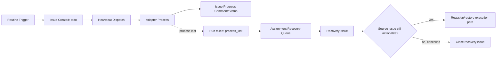
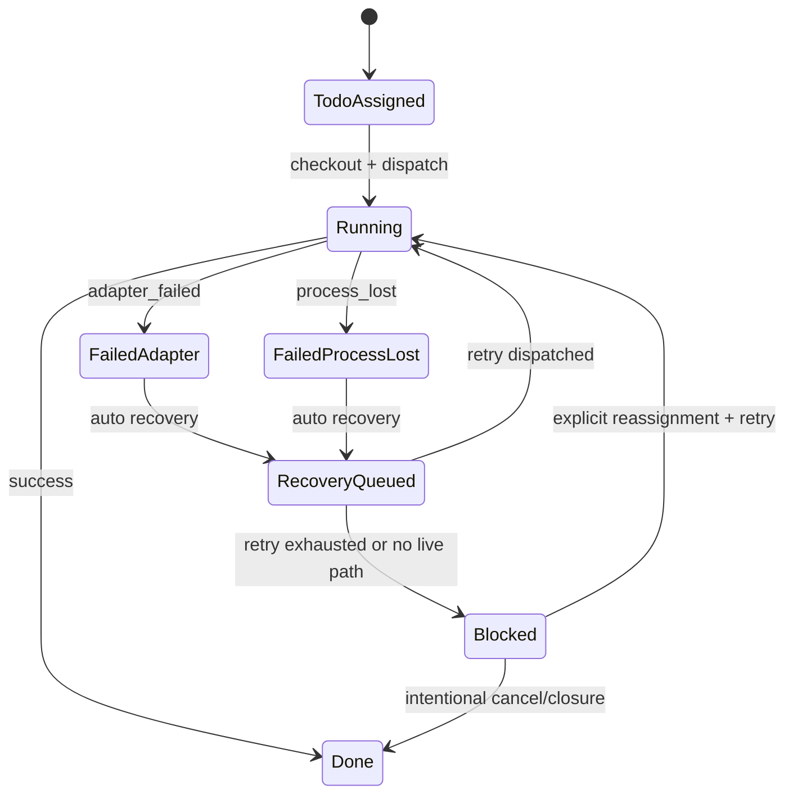

# NOD-221 — PR Manager Runtime Stabilization (Locked CTO Plan)

## Scope
Stabilize PR Manager runtime behavior after `process_lost` assignment-recovery failures, and define deterministic prevention for future routine-execution lanes.

## Evidence
- Source issue: [NOD-77](/NOD/issues/NOD-77)
- Recovery issue: [NOD-225](/NOD/issues/NOD-225)
- Failed recovery run (NOD-77): `fcfd3677-d408-441a-af75-fe33b0d04b41`
  - `status=failed`, `errorCode=process_lost`, `wakeReason=issue_assignment_recovery`
  - Event: `Process lost -- server may have restarted`
- Primary historical run for NOD-77: `9848d94f-568f-4873-9440-363ecc263b15`
  - `status=failed`, `errorCode=adapter_failed`
  - Result payload: usage limit exhaustion (`"You've hit your limit"`)

## Root Cause
1. A routine-created PR assessment issue remained in backlog after an earlier adapter failure (rate-limit period).
2. Automatic assignment recovery later replayed the stale lane.
3. Recovery run lost process ownership (`process_lost`) before producing a durable execution path.
4. Recovery issue remained open even after source lane was intentionally cancelled.

This is a runtime hygiene + recovery-path control problem, not a product requirement ambiguity.

## Deterministic Remediation Applied (This Heartbeat)
1. PR Manager runtime hardening applied via agent patch:
   - `runtimeConfig.heartbeat.enabled = false` (disable timer wakes)
   - `runtimeConfig.heartbeat.wakeOnDemand = true`
   - `runtimeConfig.heartbeat.maxConcurrentRuns = 1`
   - `adapterConfig.timeoutSec = 1200`
   - `adapterConfig.graceSec = 30`
2. Closed stale recovery lane:
   - [NOD-225](/NOD/issues/NOD-225) moved to `done` with closure rationale tied to source cancellation.

## Architecture Boundaries

## Runtime State Transitions

## Trust & Failure Boundaries
- Control plane wakeup queue is authoritative for issue dispatch.
- Adapter process lifecycle is non-authoritative if pid/group disappears.
- Issue status is the durable user-facing truth; recovery issues must not outlive cancelled source lanes.
- Automated comments from cleanup/recovery must not be interpreted as human unblock signals.

## Edge Cases
1. Source issue cancelled while recovery issue still `todo`.
2. Recovery wake created with no persisted run log.
3. Process loss with pid known vs pid unknown (`server may have restarted`).
4. Multiple stale routine issues for same agent causing replay burst.
5. Mention/comment wakes on cancelled issues creating noise-only runs.

## Test Matrix (Deterministic)
| Case | Setup | Expected |
|---|---|---|
| Cancelled source + open recovery | Source `cancelled`, recovery `todo` | Recovery closes to `done` with no re-dispatch |
| Adapter failure + actionable source | `adapter_failed`, source `todo` | Recovery issue created, source moved to live owner or blocked with owner/action |
| Process lost, no pid | Inject orphan running run without pid | Run fails `process_lost`, issue escalates to blocked/recovery |
| Process lost, dead pid | Inject running run with dead pid | Single retry queued; if fails again, blocked + recovery issue |
| Timer heartbeat disabled | Agent heartbeat config disabled | No scheduler wake; assignment/comment wakes still execute |
| Run timeout guard | Long-running adapter command | Run fails `timed_out` before orphan/process-lost cascade |

## Operational Checklist (Future Routine-Execution)
1. Before assigning routine lanes, verify assignee has no stale `todo` recovery backlog.
2. If source issue is intentionally cancelled, close linked recovery issue in same heartbeat.
3. Treat `process_lost` as runtime-path fault; do not leave source issue in `todo` without explicit owner/action.
4. Keep timer heartbeat disabled for PR Manager unless periodic scans are explicitly required.
5. Keep finite adapter timeout to avoid unbounded stuck runs.

## Ownership & Handoff
- CTO: completed runtime stabilization controls and recovery cleanup.
- Staff Engineer: verify no open PR Manager recovery issues remain tied to cancelled source lanes.
- QA Engineer: run control-plane regression cases for cancelled-source recovery closure and process-lost escalation behavior.
